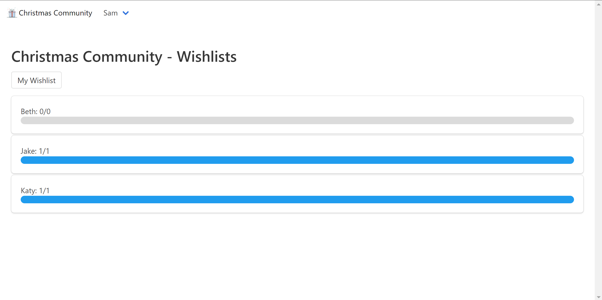
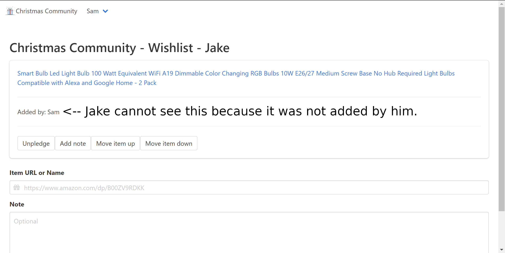
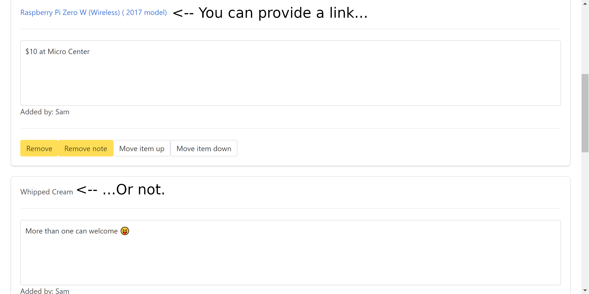

# Christmas Community


Web app for your family's Christmas shopping

## Purpose
To create a simple place for your entire family to use to find gifts that people want, and to avoid double-gifting.

## Screenshots





## Amazon Smile
By default, Christmas Community converts www.amazon.com links to smile.amazon.com. If you do not want this, set the environment variable SMILE to false (if you are using Docker Compose, make sure to put "false" in quotes).

## Docker
```
docker run --detach --name christmas-community -p 80:80 --restart always wingysam/christmas-community
```

## Docker Compose
```yml
---
version: "3"
services:
  christmas-community:
    image: wingysam/christmas-community
    volumes:
      - ./data:/data
    ports:
      # If you want to go to localhost:8080 to access Christmas Community,
      # use - 8080:80 instead of
      - 80:80
    environment:
      # Amazon Smile, set to 'false' to disable www.amazon.com links
      # turning into smile.amazon.com
      SMILE: 'true'
      # Table mode, set to 'false' to revert to box mode
      TABLE: 'true'
      # Single list mode
      # (for weddings, birthdays, etc. only the admin account's list is accessible)
      # Set to 'true' to enable
      SINGLE_LIST: 'false'
    restart: always
```

## Install
```sh
git clone https://gitlab.com/wingysam/christmas-community
cd christmas-community
yarn
```

## Configuration
Add environment variables with a .env. Example:
```env
SITE_TITLE="Christmas Zone"
PORT=80
```

## Startup
```sh
yarn start
```

## Setup
Visit `/` on the HTTP server to add an admin account.